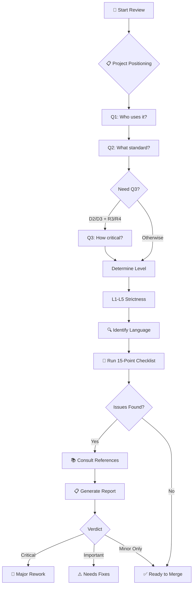

<p align="center">
  
  
  
</p>

<h1 align="center">Pragmatic Clean Code Reviewer</h1>

<p align="center">
  <strong>A Claude Code skill for conducting rigorous code reviews based on software engineering classics</strong>
</p>

<p align="center">
  <a href="#features">Features</a> •
  <a href="#installation">Installation</a> •
  <a href="#usage">Usage</a> •
  <a href="#project-positioning">Project Positioning</a> •
  <a href="#rule-sources">Rule Sources</a> •
  <a href="#license">License</a>
</p>

---

## Overview

This skill transforms Claude Code into a **strict code review expert** that evaluates your code against 350+ rules from three foundational software engineering books:

| Book | Author | Rules |
|------|--------|-------|
| 📗 **The Pragmatic Programmer** | David Thomas & Andrew Hunt | 100 Tips |
| 📘 **Clean Code** | Robert C. Martin | 202 Rules |
| 📙 **Clean Architecture** | Robert C. Martin | 48 Principles |

> **Philosophy:** Let machines handle formatting; humans focus on logic and design.

---

## How It Works



### Review Steps

| Step | Action | Purpose |
|------|--------|---------|
| 1️⃣ | Ask project positioning (Q1/Q2/Q3) | Determine L1-L5 strictness |
| 2️⃣ | Identify language paradigm | Adjust OOP-centric rules |
| 3️⃣ | Run 15-point checklist | Systematic code evaluation |
| 4️⃣ | Consult reference files | Look up detailed rules (350+) |
| 5️⃣ | Generate report | Cite rules, prioritize issues |

---

## Features

### 🎯 3+4+2 Project Positioning System

A refined questionnaire system that determines the right strictness level:

```
Q1: Who will use this code? (3 options)
├── 🧑 Solo — Only myself
├── 👥 Internal — Team/company
└── 🌍 External — External users/OSS

Q2: What standard? (4 options)
├── 🚀 Ship — Just make it work
├── 📦 Normal — Basic quality
├── 🛡️ Careful — Careful review
└── 🔒 Strict — Highest standard

Q3: How critical? (2 options, conditional)
├── 🔧 Normal — Can wait for fix
└── 💎 Critical — Outage if broken

→ Results in L1-L5 strictness level
```

### 🏷️ Five Strictness Levels

| Level | Name | Key Question | Examples |
|-------|------|--------------|----------|
| **L1** | 🧪 Lab | Does it run? | Experiments, scripts |
| **L2** | 🛠️ Tool | Understandable next month? | Personal tools |
| **L3** | 🤝 Team | Can teammates take over? | Team projects |
| **L4** | 🚀 Infra | Others suffer if broken? | Internal SDKs |
| **L5** | 🏛️ Critical | Can it pass audit? | Finance, medical |

### ✅ 15-Point Review Checklist

Quick but comprehensive review covering:

| Category | Checks |
|----------|--------|
| **Correctness** | Logic, boundaries, security |
| **Readability** | Naming, function size, comments |
| **Architecture** | SRP, DRY, dependency direction |
| **Testing** | Coverage, independence |
| **Advanced** | Concurrency, security, resources, performance |

### 📋 Standardized Reporting

Every review produces a consistent, visually clear report with detailed rule explanations:

```markdown
## 📋 Code Review Report

**Project Positioning:** L3 Team
**Review Scope:** src/services/*.ts

### 🔴 Critical Issues (Must Fix)
- [auth.ts:45] SQL query built with string concatenation
  - **Rule:** PP-72 (Keep It Simple and Minimize Attack Surfaces)
  - **Principle:** String concatenation in SQL creates injection vulnerabilities
  - **Suggestion:** Use parameterized queries

### 🟡 Important Issues (Should Fix)
- [user.ts:120] Function `processData` has 8 parameters
  - **Rule:** CC-26 (Function Arguments)
  - **Principle:** Many parameters increase cognitive load. L3 threshold is ≤5.
  - **Suggestion:** Group into a parameter object

### 🔵 Minor Issues (Nice to Have)
- [utils.ts:33] Magic number `86400`
  - **Rule:** CC-175 (Replace Magic Numbers with Named Constants)

### ✅ Strengths
- Good separation of concerns
- Consistent naming conventions

### 📝 Verdict
⚠️ Needs fixes — Critical SQL injection issue must be addressed
```

### 🔖 Rule Citation System

Every issue references its source rule for learning and dispute resolution:

| Prefix | Source |
|--------|--------|
| **PP-##** | The Pragmatic Programmer |
| **CC-##** | Clean Code |
| **CA-##** | Clean Architecture |

### 🌐 Language-Aware Review

Rules are adjusted based on programming language paradigm:

| Paradigm | Languages | Applicability |
|----------|-----------|---------------|
| Pure OOP | Java, C# | ✅ Full |
| Multi-paradigm | TypeScript, Python, Kotlin | ⚠️ Adjusted |
| Functional | Haskell, Elixir, F# | ⚠️ Limited |
| Systems | Rust, Go, Zig | ⚠️ Different patterns |

---

## Installation

### Quick Install (Recommended)

Choose your tool and run the corresponding command:

| Tool | Install Command |
|------|-----------------|
| **Claude Code** | `git clone https://github.com/Zhen-Bo/pragmatic-clean-code-reviewer.git ~/.claude/skills/pragmatic-clean-code-reviewer` |
| **OpenCode** | `git clone https://github.com/Zhen-Bo/pragmatic-clean-code-reviewer.git ~/.config/opencode/skills/pragmatic-clean-code-reviewer` |
| **Codex** | `git clone https://github.com/Zhen-Bo/pragmatic-clean-code-reviewer.git ~/.codex/skills/pragmatic-clean-code-reviewer` |

### From GitHub Release

1. Go to [Releases](https://github.com/Zhen-Bo/pragmatic-clean-code-reviewer/releases)
2. Download the latest `.skill` or `.zip` file
3. Extract to your skills directory:

```bash
# Claude Code
unzip pragmatic-clean-code-reviewer-v*.zip -d ~/.claude/skills/

# OpenCode
unzip pragmatic-clean-code-reviewer-v*.zip -d ~/.config/opencode/skills/

# Codex
unzip pragmatic-clean-code-reviewer-v*.zip -d ~/.codex/skills/
```

### Skills Directory Reference

| Tool | Skills Directory |
|------|------------------|
| Claude Code | `~/.claude/skills/` |
| OpenCode | `~/.config/opencode/skills/` |
| Codex | `~/.codex/skills/` |

### Verify Installation

After installation, verify the skill is detected:

```bash
# Check the skill file exists
ls ~/.claude/skills/pragmatic-clean-code-reviewer/SKILL.md
```

---

## Usage

### Invoke the Skill

```
/pragmatic-clean-code-reviewer
```

### Or Use Natural Language

- *"Review my code for code smells"*
- *"Check if this PR is ready to merge"*
- *"Audit the architecture of this module"*
- *"Is this code clean enough?"*

---

## Project Positioning

### Quick Lookup Table

| Who (Q1) | Standard (Q2) | Critical (Q3) | Level | Example |
|----------|---------------|---------------|-------|---------|
| Solo | Ship | - | L1 | Experiment script |
| Solo | Normal | - | L1 | Personal utility |
| Solo | Careful | - | L2 | Long-term personal project |
| Solo | Strict | - | L3 | Perfectionist project |
| Internal | Ship | - | L1 | Team prototype |
| Internal | Normal | - | L2 | Team daily development |
| Internal | Careful | Normal | L2 | Internal helper tool |
| Internal | Careful | Critical | L3 | **Internal SDK** |
| Internal | Strict | Normal | L3 | Internal tool (high std) |
| Internal | Strict | Critical | L4 | **Internal core infra** |
| External | Ship | - | L2 | Product MVP |
| External | Normal | - | L3 | General product feature |
| External | Careful | Normal | L3 | Small OSS tool |
| External | Careful | Critical | L4 | **Product core feature** |
| External | Strict | Normal | L4 | OSS tool (high std) |
| External | Strict | Critical | L5 | **Finance/Medical/Core OSS** |

### Strictness Matrix

| Check | L1 | L2 | L3 | L4 | L5 |
|-------|----|----|----|----|-----|
| Functional Correctness | ★★★ | ★★★★ | ★★★★★ | ★★★★★ | ★★★★★ |
| Error Handling | ★ | ★★ | ★★★ | ★★★★ | ★★★★★ |
| Naming & Readability | ★ | ★★★ | ★★★★ | ★★★★★ | ★★★★★ |
| Architecture | ☆ | ★ | ★★★ | ★★★★★ | ★★★★★ |
| Testing | ☆ | ★ | ★★★ | ★★★★ | ★★★★★ |

---

## Rule Sources

### 📗 The Pragmatic Programmer (PP-1 to PP-100)

> *"Care about your craft. Think about your work."*

Key principles: 
- **DRY** (Don't Repeat Yourself) - PP-15
- **YAGNI** (You Aren't Gonna Need It) - PP-43
- **ETC** (Easy To Change) - PP-14
- Design by Contract - PP-37

### 📘 Clean Code (CC-1 to CC-202)

> *"Clean code reads like well-written prose."*

Key principles:
- **KISS** (Keep It Simple) - CC-130
- Small functions - CC-20, CC-21
- Meaningful names - CC-4
- **SOLID** - CA-8~12

### 📙 Clean Architecture (CA-1 to CA-48)

> *"The goal of software architecture is to minimize human resources."*

Key principles:
- **SOLID** - CA-8~12
- Dependency Rule - CA-31
- Screaming Architecture - CA-30
- Plugin Architecture - CA-47
- Component Cohesion: **REP** (CA-14), **CCP** (CA-15), **CRP** (CA-16)
- Component Coupling: **ADP** (CA-18), **SDP** (CA-19), **SAP** (CA-20)

---

## Metrics Guidelines

> **These are conversation starters, not hard gates.** A clear 60-line function beats three confusing 20-line functions *(exemption rationale, not default tolerance)*.

| Metric | L1 | L2 | L3 | L4 | L5 |
|--------|-----|-----|-----|-----|-----|
| Function length | N/A | ≤80 | ≤50 | ≤30 | ≤20 |
| Parameter count | N/A | ≤7 | ≤5 | ≤3 | ≤2 |
| Nesting depth | N/A | ≤5 | ≤4 | ≤3 | ≤2 |
| PR size (lines) | N/A | ≤800 | ≤500 | ≤300 | ≤200 |
| Test coverage | N/A | 30% | 60% | 80% | 95% |
| DRY tolerance (max repeats) | N/A | 4 | 3 | 2 | 1 |

---

## Code Smells Quick Reference

| Smell | Rule | Detection |
|-------|------|-----------|
| Long Function | CC-20 | Exceeds level threshold? (See Metrics Guidelines) |
| Too Many Params | CC-26 | Exceeds level threshold? (See Metrics Guidelines) |
| Magic Numbers | CC-175 | Unnamed constants |
| Feature Envy | CC-164 | Using other class's data |
| God Class | CA-8 | Multiple responsibilities |
| Train Wreck | CC-81 | `a.b().c().d()` chains |

---

## File Structure

```
pragmatic-clean-code-reviewer/
├── SKILL.md                      # Main skill entry point
├── README.md                     # This file
├── LICENSE                       # MIT License
└── references/                   # Detailed reference materials
    ├── positioning.md            # 3+4+2 system + L1-L5 mapping
    ├── principles-glossary.md    # YAGNI, KISS, DRY, SOLID, etc.
    ├── principles-spectrum.md    # DRY vs WET spectrum guide
    ├── pragmatic-programmer.md   # PP-1 to PP-100
    ├── clean-code.md             # CC-1 to CC-202
    ├── clean-architecture.md     # CA-1 to CA-48
    ├── language-adjustments.md   # Language-specific rules
    └── quick-lookup.md           # Symptom → Rule lookup
```

---

## Contributing

Contributions are welcome! Please feel free to:

- 🐛 Report issues
- 💡 Suggest new rules or improvements
- 🔧 Submit pull requests

---

## License

MIT License - See [LICENSE](LICENSE) for details.

---

## Credits

Based on principles from:
- 📗 *"The Pragmatic Programmer"* by David Thomas and Andrew Hunt
- 📘 *"Clean Code"* by Robert C. Martin
- 📙 *"Clean Architecture"* by Robert C. Martin

---

<p align="center">
  <sub>Built with principles from software engineering classics</sub>
</p>

<p align="center">
  
  
</p>
