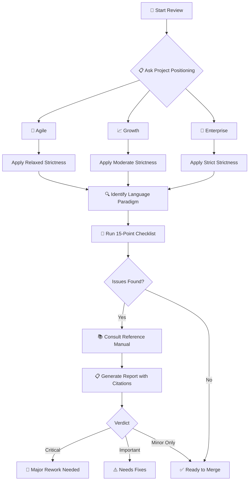

<p align="center">
  
  
  
</p>

<h1 align="center">Pragmatic Clean Code Reviewer</h1>

<p align="center">
  <strong>A Claude Code skill for conducting rigorous code reviews based on software engineering classics</strong>
</p>

<p align="center">
  <a href="#features">Features</a> •
  <a href="#installation">Installation</a> •
  <a href="#usage">Usage</a> •
  <a href="#project-types">Project Types</a> •
  <a href="#rule-sources">Rule Sources</a> •
  <a href="#license">License</a>
</p>

---

## Overview

This skill transforms Claude Code into a **strict code review expert** that evaluates your code against 350+ rules from three foundational software engineering books:

| Book | Author | Rules |
|------|--------|-------|
| 📗 **The Pragmatic Programmer** | David Thomas & Andrew Hunt | 100 Tips |
| 📘 **Clean Code** | Robert C. Martin | 202 Rules |
| 📙 **Clean Architecture** | Robert C. Martin | 48 Principles |

> **Philosophy:** Let machines handle formatting; humans focus on logic and design.

---

## How It Works



### Review Steps

| Step | Action | Purpose |
|------|--------|---------|
| 1️⃣ | Ask project positioning | Calibrate strictness level |
| 2️⃣ | Identify language paradigm | Adjust OOP-centric rules |
| 3️⃣ | Run 15-point checklist | Systematic code evaluation |
| 4️⃣ | Consult reference manual | Look up detailed rules (350+) |
| 5️⃣ | Generate report | Cite rules, prioritize issues |

---

## Features

### 🎯 Project-Aware Strictness

Before each review, the skill asks about your project's positioning and adjusts its strictness accordingly:

```
┌──────────────────────────────────────────────────────────────┐
│  What is the project's positioning?                          │
│                                                              │
│  1. Agile (MVP)    → Relaxed   (Ship it if it works)         │
│  2. Growth         → Moderate  (Balance speed & quality)     │
│  3. Enterprise     → Strict    (Think of maintainers 5y+)    │
└──────────────────────────────────────────────────────────────┘
```

### ✅ 15-Point Review Checklist

Quick but comprehensive review covering:

| Category | Checks |
|----------|--------|
| **Correctness** | Logic, boundaries, security |
| **Readability** | Naming, function size, comments |
| **Architecture** | SRP, DRY, dependency direction |
| **Testing** | Coverage, independence |
| **Advanced** | Concurrency, security, resources, performance |

### 📋 Standardized Reporting

Every review produces a consistent, visually clear report:

```markdown
## 📋 Code Review Report

**Project Positioning:** Growth
**Review Scope:** src/services/*.ts

### 🔴 Critical Issues (Must Fix)
- [auth.ts:45] SQL injection vulnerability (PP-72)

### 🟡 Important Issues (Should Fix)
- [user.ts:120] Function exceeds 50 lines (CC-20)

### 🔵 Minor Issues (Nice to Have)
- [utils.ts:33] Magic number should be named constant (CC-175)

### ✅ Strengths
- Good separation of concerns
- Consistent naming conventions

### 📝 Verdict
⚠️ Needs fixes before merge
```

### 🔖 Rule Citation System

Every issue references its source rule for learning and dispute resolution:

| Prefix | Source |
|--------|--------|
| **PP-##** | The Pragmatic Programmer |
| **CC-##** | Clean Code |
| **CA-##** | Clean Architecture |

### 🌐 Language-Aware Review

Rules are adjusted based on programming language paradigm:

| Paradigm | Languages | Applicability |
|----------|-----------|---------------|
| Pure OOP | Java, C# | ✅ Full |
| Multi-paradigm | TypeScript, Python, Kotlin | ⚠️ Adjusted |
| Functional | Haskell, Elixir, F# | ⚠️ Limited |
| Systems | Rust, Go, Zig | ⚠️ Different patterns |

For unknown languages, the skill will ask about paradigm or search for characteristics.

---

## Installation

### For Claude Code

```bash
# Option 1: Clone directly to skills directory
git clone https://github.com/Zhen-Bo/pragmatic-clean-code-reviewer.git \
  ~/.claude/skills/pragmatic-clean-code-reviewer

# Option 2: Manual copy
mkdir -p ~/.claude/skills/pragmatic-clean-code-reviewer
cp SKILL.md reference-manual.md ~/.claude/skills/pragmatic-clean-code-reviewer/
```

### For Codex

```bash
git clone https://github.com/Zhen-Bo/pragmatic-clean-code-reviewer.git \
  ~/.codex/skills/pragmatic-clean-code-reviewer
```

---

## Usage

### Invoke the Skill

```
/pragmatic-clean-code-reviewer
```

### Or Use Natural Language

- *"Review my code for code smells"*
- *"Check if this PR is ready to merge"*
- *"Audit the architecture of this module"*
- *"Is this code clean enough?"*

---

## Project Types

| Type | Goal | Strictness | Typical Use Cases |
|------|------|------------|-------------------|
| **🚀 Agile** | Validate fast | ★☆☆☆☆ | MVP, hackathon, POC |
| **📈 Growth** | Scale smart | ★★★☆☆ | Post-Series B, growing teams |
| **🏢 Enterprise** | Stability first | ★★★★★ | Finance, medical, government |

### Strictness Matrix

| Check | Agile | Growth | Enterprise |
|-------|-------|--------|------------|
| Functional Correctness | ★★★★★ | ★★★★★ | ★★★★★ |
| Error Handling | ★★ | ★★★ | ★★★★★ |
| Naming & Readability | ★★★ | ★★★★ | ★★★★★ |
| Architecture (SRP/DIP) | ★ | ★★★ | ★★★★★ |
| Testing | ★★ | ★★★★ | ★★★★★ |

---

## Rule Sources

### 📗 The Pragmatic Programmer (PP-1 to PP-100)

> *"Care about your craft. Think about your work."*

Key principles: DRY, ETC (Easy To Change), Tracer Bullets, Design by Contract

### 📘 Clean Code (CC-1 to CC-202)

> *"Clean code reads like well-written prose."*

Key principles: Small functions, meaningful names, no side effects, SOLID

### 📙 Clean Architecture (CA-1 to CA-48)

> *"The goal of software architecture is to minimize human resources."*

Key principles: Dependency Rule, Screaming Architecture, Plugin Architecture

---

## Metrics Guidelines (Soft Reference)

> **These are conversation starters, not hard gates.** A clear 60-line function beats three confusing 20-line functions.

### From Clean Code (Explicit Thresholds)

| Metric | Book Quote | Agile | Growth | Enterprise |
|--------|------------|-------|--------|------------|
| **Function Length** | *"hardly ever be 20 lines"* | ≤ 50 | ≤ 30 | ≤ 20 |
| **Parameters** | *"three should be avoided"* | ≤ 5 | ≤ 3 | ≤ 2 |
| **Nesting Depth** | *"one or two indent levels"* | ≤ 4 | ≤ 3 | ≤ 2 |

### From The Pragmatic Programmer

| Principle | Application | Agile | Growth | Enterprise |
|-----------|-------------|-------|--------|------------|
| **Small Steps** | Commit/PR size | ≤ 500 | ≤ 300 | ≤ 200 lines |

---

## Code Smells Quick Reference

| Smell | Rule | Detection |
|-------|------|-----------|
| Long Function | CC-20 | > 30-50 lines |
| Too Many Params | CC-26 | > 3 parameters |
| Magic Numbers | CC-175 | Unnamed constants |
| Feature Envy | CC-164 | Using other class's data |
| God Class | CA-8 | Multiple responsibilities |
| Train Wreck | CC-81 | `a.b().c().d()` chains |

---

## File Structure

```
pragmatic-clean-code-reviewer/
├── SKILL.md              # Main skill (review workflow)
├── reference-manual.md   # Complete 350+ rules reference
├── README.md             # This file
└── LICENSE               # MIT License
```

---

## Contributing

Contributions are welcome! Please feel free to:

- 🐛 Report issues
- 💡 Suggest new rules or improvements
- 🔧 Submit pull requests

---

## License

MIT License - See [LICENSE](LICENSE) for details.

---

## Credits

Based on principles from:
- 📗 *"The Pragmatic Programmer"* by David Thomas and Andrew Hunt
- 📘 *"Clean Code"* by Robert C. Martin
- 📙 *"Clean Architecture"* by Robert C. Martin

---

<p align="center">
  <sub>Built with principles from software engineering classics</sub>
</p>

<p align="center">
  
  
</p>
