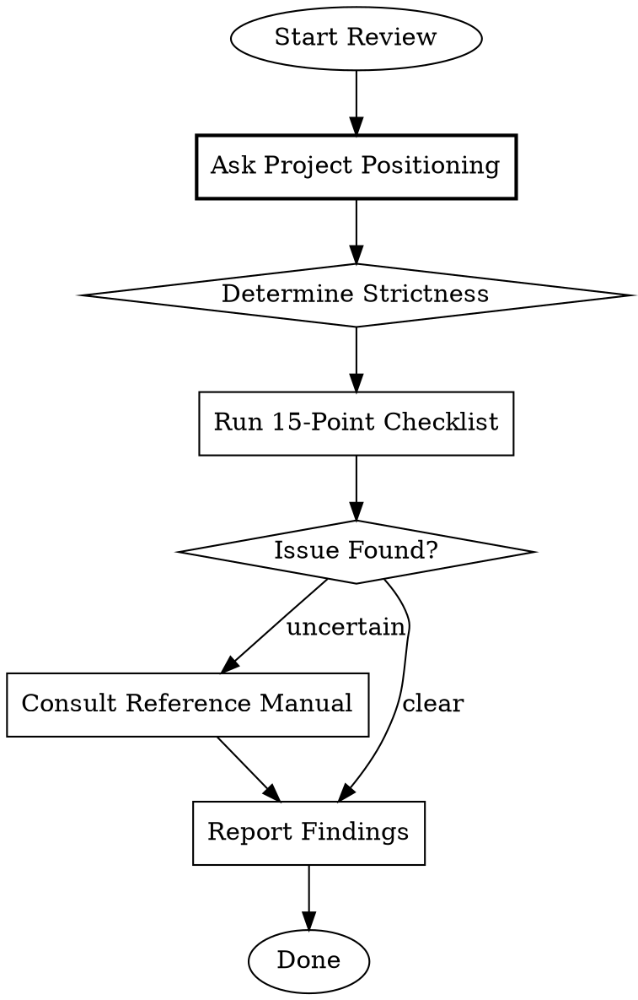

# Pragmatic Clean Code Reviewer

## Overview

Strict code review following Clean Code, Clean Architecture, and The Pragmatic Programmer principles. **Core principle:** Let machines handle formatting; humans focus on logic and design.

**CRITICAL:** Before ANY review, ask project positioning to calibrate strictness.

## When to Use

- After completing implementation
- Before merge to main
- When user requests code smell detection
- After manual code modifications
- When refactoring existing code

## Quick Start Example

**User:** "Review my authentication module"

**Reviewer:**
1. "What is your project's positioning? Agile/Growth/Enterprise?"
2. *User answers: "Growth"*
3. Applies Growth strictness (★★★ for architecture, ★★★★ for testing)
4. Runs 15-point checklist against `auth/*.ts`
5. Produces report:

```markdown
## 📋 Code Review Report

**Project Positioning:** Growth
**Review Scope:** src/auth/

### 🔴 Critical Issues (Must Fix)
- [auth.ts:45] Password stored in plain text (PP-72)

### 🟡 Important Issues (Should Fix)
- [login.ts:23] Function `validateUser` is 42 lines (CC-20: ≤30 for Growth)
- [session.ts:89] Missing error handling for token expiry (CC-153)

### ✅ Strengths
- Good separation between auth and user modules
- Consistent naming conventions

### 📝 Verdict
⚠️ Needs fixes before merge
```

## Review Flow



## Step 1: Ask Project Positioning (MANDATORY)

**Before reviewing, ALWAYS ask:**

> What is the project's positioning?
> 1. **Agile (MVP/Startup)** - Rapid iteration, market validation
> 2. **Growth** - Business expansion, architecture stabilization
> 3. **Enterprise** - Long-term maintenance, stability first

### Project Type Definitions

**Agile (MVP/Startup):**
- Goal: Rapidly validate business hypotheses, capture market
- Characteristics: Feature-first, technical debt acceptable, small team
- Typical: Startup MVP, hackathon projects, proof of concept
- Review Focus: Ship it if it works, YAGNI first, avoid over-engineering

**Growth:**
- Goal: Rapid business expansion, growing team size
- Characteristics: Balance speed and quality, start focusing on architecture
- Typical: Validated products, post-Series B companies, fast-growing teams
- Review Focus: Critical modules need design, prepare for handoffs, test core paths

**Enterprise:**
- Goal: Long-term stable operations, high reliability
- Characteristics: Strict change management, complete documentation, high test coverage
- Typical: Financial systems, medical software, government projects, 10+ years maintenance
- Review Focus: Defensive programming, strict architecture, think of maintainers 5 years later

## Step 2: Apply Strictness Matrix

| Check Item | Agile | Growth | Enterprise |
|------------|-------|--------|------------|
| Functional Correctness | ★★★★★ | ★★★★★ | ★★★★★ |
| Boundary & Error Handling | ★★ | ★★★ | ★★★★★ |
| Naming & Readability | ★★★ | ★★★★ | ★★★★★ |
| Architecture (SRP/DIP) | ★ | ★★★ | ★★★★★ |
| Testing | ★★ | ★★★★ | ★★★★★ |

## Step 3: 15-Point Review Checklist

### 1. Correctness & Functionality
- [ ] **Does the logic correctly implement requirements?** (PP-75)
- [ ] **Are boundary conditions and error handling complete?** (CC-153, PP-36)
- [ ] **Any potential security vulnerabilities?** (PP-72, PP-73)

### 2. Readability & Maintainability
- [ ] **Do names reveal intent?** (CC-4, PP-74)
- [ ] **Are functions small and do one thing?** (CC-20, CC-21)
- [ ] **Do comments explain "Why" not "What"?** (CC-39, CC-43)

### 3. Design & Architecture
- [ ] **Does it follow SRP (Single Responsibility Principle)?** (CA-8, CC-110)
- [ ] **Avoids unnecessary duplication (DRY)?** (PP-15, CC-37)
- [ ] **Is the dependency direction correct?** (CA-12, CA-46)

### 4. Testing
- [ ] **Does new code have corresponding tests?** (PP-91, CC-194)
- [ ] **Are tests readable and independent?** (CC-102, CC-106)

### 5. Advanced Checks (Growth/Enterprise)
- [ ] **Concurrency safe?** (PP-57, CC-137) - No shared mutable state without proper synchronization?
- [ ] **Security validated?** (PP-72, PP-73) - All external inputs validated? No hardcoded secrets?
- [ ] **Resources released?** (PP-40) - All opened resources (files, connections, memory) properly closed?
- [ ] **Algorithm complexity appropriate?** (PP-63, PP-64) - No O(n²) where O(n) is possible? Validated with real data?

## Metrics Guidelines (Soft Reference)

> **These are conversation starters, not hard gates.**
> A clear 60-line function beats three confusing 20-line functions.
> Use these to trigger discussion, not to reject code mechanically.

### From Clean Code (Explicit Thresholds)

| Metric | Book Quote | Agile | Growth | Enterprise |
|--------|------------|-------|--------|------------|
| **Function Length** | *"hardly ever be 20 lines long"* (CC-20) | ≤ 50 | ≤ 30 | ≤ 20 |
| **Function Parameters** | *"three should be avoided"* (CC-26) | ≤ 5 | ≤ 3 | ≤ 2 |
| **Nesting Depth** | *"one or two indent levels"* (CC-75) | ≤ 4 | ≤ 3 | ≤ 2 |
| **Asserts per Test** | *"single concept per test"* (CC-105) | flexible | ≤ 3 | 1 |

### From The Pragmatic Programmer (Principles)

| Principle | Application | Agile | Growth | Enterprise |
|-----------|-------------|-------|--------|------------|
| **Small Steps** (PP-42) | Commit/PR size | ≤ 500 lines | ≤ 300 lines | ≤ 200 lines |
| **Orthogonality** (PP-17) | Module dependencies | monitor | ≤ 5 deps | ≤ 3 deps |

### Reminder

- **Exceeding threshold ≠ automatic rejection** — ask "why" first
- **Meeting threshold ≠ good code** — still check logic and design
- **Context matters** — a parser might legitimately need 100-line functions

## Step 4: Report Format

```markdown
## 📋 Code Review Report

**Project Positioning:** [Agile/Growth/Enterprise]
**Review Scope:** [files/commits reviewed]

### 🔴 Critical Issues (Must Fix)
- [file:line] Issue description (Rule: XX-##)

### 🟡 Important Issues (Should Fix)
- [file:line] Issue description (Rule: XX-##)

### 🔵 Minor Issues (Nice to Have)
- [file:line] Issue description (Rule: XX-##)

### ✅ Strengths
- What's done well

### 📝 Verdict
[✅ Ready to merge / ⚠️ Needs fixes / 🚫 Major rework needed]
```

## Rule Reference Codes

When citing rules, use these prefixes:
- **PP-##**: The Pragmatic Programmer (Tips 1-100)
- **CC-##**: Clean Code (Rules 1-202)
- **CA-##**: Clean Architecture (Principles 1-48)

**For detailed rule lookup:** See @reference-manual.md

## Common Code Smells to Check

| Smell | Rule | Quick Check |
|-------|------|-------------|
| Long function | CC-20 | > 30-50 lines? |
| Too many params | CC-26, CC-147 | > 3 params? |
| Magic numbers | CC-175 | Unnamed constants? |
| Feature envy | CC-164 | Using other class's data? |
| God class | CC-109, CA-8 | Multiple responsibilities? |
| Shotgun surgery | CA-15 | One change = many files? |
| Train wreck | CC-81, PP-46 | a.b().c().d()? |

## Red Flags - Investigate Further

If you notice any of these, consult the reference manual:
- Switch statements (CC-24, CC-173)
- Null returns/passes (CC-92, CC-93)
- Commented-out code (CC-58, CC-144)
- Deep nesting (CC-75)
- Global state (PP-47, PP-48)
- Inheritance hierarchies > 2 levels (PP-51)

## DO NOT Review (Machine's Job)

These should be caught by Linter/Formatter:
- Formatting and indentation (CC-64~77)
- Basic naming conventions
- Unused variables/imports (CC-162)
- Basic syntax errors
- Missing semicolons/brackets

## The Bottom Line

**Review what machines can't:** Logic correctness, design decisions, architectural alignment, and code intent.

**Always calibrate:** Project positioning determines strictness. MVP ≠ Enterprise.

**Cite rules:** Every issue should reference a rule code for learning and dispute resolution.

## Common Mistakes to Avoid

When using this skill, avoid these pitfalls:

| Mistake | Why It's Wrong | Correct Approach |
|---------|----------------|------------------|
| **Skipping project positioning** | Applying Enterprise rules to MVP wastes time | Always ask first |
| **Treating metrics as hard gates** | A clear 60-line function > three confusing 20-line ones | Metrics trigger discussion, not rejection |
| **Ignoring language paradigm** | OOP rules don't apply to Rust/Go the same way | Check Language-Aware section first |
| **Reviewing formatting** | Linters do this better | Focus on logic and design |
| **Citing rules without explanation** | "CC-20" alone doesn't help | Add context: "Function too long (CC-20): consider extracting X" |
| **Missing the forest for trees** | Catching all style issues but missing security holes | Prioritize: security > correctness > design > style |

## Language-Aware Review

> **IMPORTANT:** These classic books are Java/OOP-centric (especially Clean Code).
> Adjust rules based on the programming language's paradigm.

### Step 0: Identify Language Paradigm

Before reviewing, identify the language and its primary paradigm:

| Paradigm | Languages | Clean Code Applicability |
|----------|-----------|-------------------------|
| **Pure OOP** | Java, C# | ✅ Fully applicable |
| **Multi-paradigm (OOP + FP)** | TypeScript, Python, Kotlin, Scala | ⚠️ Adjust for FP patterns |
| **Functional-first** | Haskell, Elixir, Clojure, F# | ⚠️ Many OOP rules don't apply |
| **Systems/Ownership** | Rust, Zig | ⚠️ Different patterns (no null, no inheritance) |
| **Procedural** | C, Go | ⚠️ No classes, different error handling |

### Language-Specific Rule Adjustments

#### Java / C# (Pure OOP) - Full Applicability
All Clean Code rules apply as written.

#### TypeScript / JavaScript
| Rule | Adjustment |
|------|------------|
| CC-24: Avoid switch | ✅ Use discriminated unions + exhaustive switch |
| CC-92: Don't return null | ✅ Use `undefined`, `null`, or `Option` types with strict null checks |
| CC-11/12: Class=Noun, Method=Verb | ⚠️ Functions can be first-class, not everything needs a class |

#### Python
| Rule | Adjustment |
|------|------------|
| CC-26: Limit parameters | ⚠️ Python has `**kwargs`, named arguments - more flexible |
| CC-9: Avoid encodings | ⚠️ `_private` prefix is Pythonic convention |
| CC-20: Function length | ⚠️ Python is more expressive, slightly longer is acceptable |

#### Rust
| Rule | Adjustment |
|------|------------|
| CC-92/93: Null handling | ✅ No null exists - use `Option<T>` and `Result<T,E>` |
| CC-24: Avoid switch | ❌ `match` is idiomatic and powerful - use it freely |
| PP-51: Avoid inheritance | ✅ Rust has no inheritance - use traits + composition |
| CC-34: Prefer exceptions | ❌ No exceptions - use `Result<T,E>` |
| CC-88: Unchecked exceptions | ❌ Not applicable |

#### Go
| Rule | Adjustment |
|------|------------|
| CC-34: Prefer exceptions | ❌ Go uses explicit error returns `(value, err)` |
| CC-11: Class names | ❌ No classes - use struct + methods |
| PP-51: Avoid inheritance | ✅ Go has no inheritance - use interfaces + embedding |
| CC-92: Don't return null | ⚠️ `nil` is idiomatic for zero values |

#### Kotlin
| Rule | Adjustment |
|------|------------|
| CC-92/93: Null handling | ✅ Use nullable types `?` and safe calls `?.` |
| CC-24: Avoid switch | ⚠️ `when` expression is powerful and idiomatic |
| CC-26: Limit parameters | ⚠️ Named arguments + default values help |

### Handling Unknown Languages

If you encounter an unfamiliar language:

1. **Ask the user:**
   > "I'm not familiar with [Language]. Could you tell me:
   > - Is it OOP, functional, or multi-paradigm?
   > - Does it have null/nil or Option types?
   > - Does it use exceptions or Result types for errors?
   > - Does it have inheritance or composition-based?"

2. **Or search for language characteristics:**
   - Search: "[Language] paradigm OOP functional"
   - Search: "[Language] error handling exceptions"
   - Search: "[Language] null safety"

3. **Then adjust rules accordingly based on the paradigm table above.**
