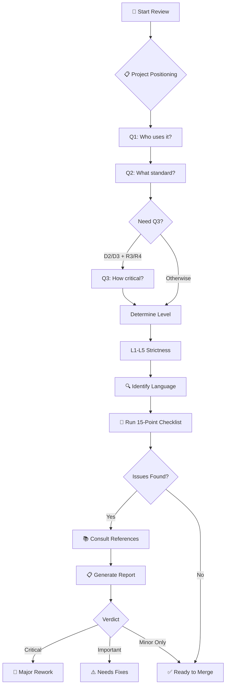

# Features

Detailed feature documentation for Pragmatic Clean Code Reviewer.

## 🎯 3+4+2 Project Positioning System

A refined questionnaire system that determines the right strictness level:

```
Q1: Who will use this code? (3 options)
├── 🧑 Solo — Only myself
├── 👥 Internal — Team/company
└── 🌍 External — External users/OSS

Q2: What standard? (4 options)
├── 🚀 Ship — Just make it work
├── 📦 Normal — Basic quality
├── 🛡️ Careful — Careful review
└── 🔒 Strict — Highest standard

Q3: How critical? (2 options, conditional)
├── 🔧 Normal — Can wait for fix
└── 💎 Critical — Outage if broken

→ Results in L1-L5 strictness level
```

## 🏷️ Five Strictness Levels

| Level | Name | Key Question | Examples |
|-------|------|--------------|----------|
| **L1** | 🧪 Lab | Does it run? | Experiments, scripts |
| **L2** | 🛠️ Tool | Understandable next month? | Personal tools |
| **L3** | 🤝 Team | Can teammates take over? | Team projects |
| **L4** | 🚀 Infra | Others suffer if broken? | Internal SDKs |
| **L5** | 🏛️ Critical | Can it pass audit? | Finance, medical |

## ✅ 15-Point Review Checklist

Quick but comprehensive review covering:

| Category | Checks |
|----------|--------|
| **Correctness** | Logic, boundaries, security |
| **Readability** | Naming, function size, comments |
| **Architecture** | SRP, DRY, dependency direction |
| **Testing** | Coverage, independence |
| **Advanced** | Concurrency, security, resources, performance |

## 📋 Standardized Reporting

Every review produces a consistent, visually clear report with detailed rule explanations:

```markdown
## 📋 Code Review Report

**Project Positioning:** L3 Team
**Review Scope:** src/services/*.ts

### 🔴 Critical Issues (Must Fix)
- [auth.ts:45] SQL query built with string concatenation
  - **Rule:** PP-72 (Keep It Simple and Minimize Attack Surfaces)
  - **Principle:** String concatenation in SQL creates injection vulnerabilities
  - **Suggestion:** Use parameterized queries

### 🟡 Important Issues (Should Fix)
- [user.ts:120] Function `processData` has 8 parameters
  - **Rule:** CC-26 (Function Arguments)
  - **Principle:** Many parameters increase cognitive load. L3 threshold is ≤5.
  - **Suggestion:** Group into a parameter object

### 🔵 Minor Issues (Nice to Have)
- [utils.ts:33] Magic number `86400`
  - **Rule:** CC-175 (Replace Magic Numbers with Named Constants)

### ✅ Strengths
- Good separation of concerns
- Consistent naming conventions

### 📝 Verdict
⚠️ Needs fixes — Critical SQL injection issue must be addressed
```

## 🔖 Rule Citation System

Every issue references its source rule for learning and dispute resolution:

| Prefix | Source |
|--------|--------|
| **PP-##** | The Pragmatic Programmer |
| **CC-##** | Clean Code |
| **CA-##** | Clean Architecture |

## 🌐 Language-Aware Review

Rules are adjusted based on programming language paradigm:

| Paradigm | Languages | Applicability |
|----------|-----------|---------------|
| Pure OOP | Java, C# | ✅ Full |
| Multi-paradigm | TypeScript, Python, Kotlin | ⚠️ Adjusted |
| Functional | Haskell, Elixir, F# | ⚠️ Limited |
| Systems | Rust, Go, Zig | ⚠️ Different patterns |

## How It Works


