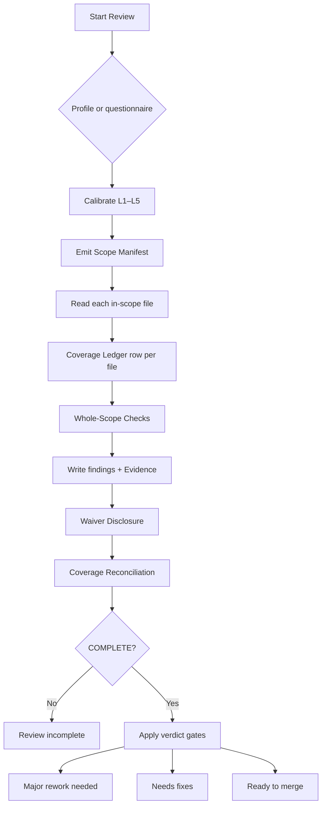

# Features

Feature documentation for Pragmatic Clean Code Reviewer (v2.0.0).

This skill reviews contract and safety risks, architecture, maintainability,
testing, and operability with calibrated severity and mandatory coverage
accounting. It is not a generic bug finder and is not a substitute for fuzzing,
formal verification, a dedicated security audit, or framework-specific static
analysis.

Canonical definitions (checklist points, thresholds, verdict gates, full report
contract) live in [SKILL.md](../SKILL.md). This page explains the features for
humans; when tables would duplicate the skill, it links instead.

## 3+4+2 Project Positioning System

A questionnaire (or a saved [review profile](review-profile.md)) determines
strictness:

```
Q1: Who will use this code? (3 options)
├── Solo — Only myself
├── Internal — Team/company
└── External — External users/OSS

Q2: What standard? (4 options)
├── Ship — Just make it work
├── Normal — Basic quality
├── Careful — Careful review
└── Strict — Highest standard

Q3: How critical? (2 options, conditional)
├── Normal — Can wait for fix
└── Critical — Outage if broken

→ Results in L1–L5 strictness level
```

Mapping table and level definitions: [SKILL.md](../SKILL.md) (Profile Discovery
and Calibration) and [project-positioning.md](project-positioning.md).
Questionnaire and D/R/C lookup: [references/positioning.md](../references/positioning.md)
(mandatory load).

## Five Strictness Levels

| Level | Name | Key Question | Examples |
|-------|------|--------------|----------|
| **L1** | Lab | Does it run? | Experiments, scripts |
| **L2** | Tool | Understandable next month? | Personal tools |
| **L3** | Team | Can teammates take over? | Team projects |
| **L4** | Infra | Others suffer if broken? | Internal SDKs |
| **L5** | Critical | Can it pass audit? | Finance, medical |

## 19-Point Review Checklist (Groups A–E)

Every review **always** scans the closed 19-point taxonomy. User-named
principles set emphasis only — never shrink scope. The 350+ rule corpus is
loaded **progressively** when a citation or paradigm adjustment needs it.

| Group | Focus |
|-------|--------|
| **A. Contract & Safety** | Contracts, boundaries/errors, security, resources, state/concurrency |
| **B. Readability** | Names, functions/control flow, comments/dead code, magic values |
| **C. Design & Architecture** | SRP, DRY, dependency direction, coupling, KISS/YAGNI, public contracts |
| **D. Testing** | Tests for changed behavior, test quality |
| **E. Performance & Operability** | Complexity, observability |

**A5** (state/concurrency) and **C6** (public contracts) baseline checks are
active at every level. Deeper analysis applies at L3+ (A5) and L4+ (C6).

Full point definitions and rule IDs: [SKILL.md — Nineteen-Point Review Checklist](../SKILL.md).

## Coverage Accounting & Standardized Reports

A findings-only response is invalid. Required blocks, in order:

1. **Header** — level, positioning, source, profile path
2. **Scope Manifest** — two-stage: PENDING → DONE with exact LOC per file
3. **Coverage Ledger** — five domain cells per file (point-auditable coding)
4. **Whole-Scope Checks** — C1 cohesion, C2 duplication, C3 dependency direction, scope/PR size
5. **🔴 Critical** · **🟡 Important** · **🔵 Minor** — omit empty severity sections
6. **Waiver Disclosure**
7. **Coverage Reconciliation** — bidirectional finding-reference match
8. **Verdict**

### Ledger cell coding

Cells are point-auditable exception codes, not free prose:

| Cell value | Meaning |
|------------|---------|
| bare `Pass` | all active points in that domain pass |
| `A2:F1` | named deviation at point A2 (finding F1) |
| `E1:Pass; E2:Gated:L4` | per-point status; gated points named explicitly |
| `N/A:…` | only for allowlisted N/A reasons |

Every finding carries exactly one `Point:` field.

### Severity and Minor reporting

Severity model (3-tier): Critical · Important · **Minor**.

- Minor: one line only, no Effort/Benefit, **never affects the verdict**
- Cap: **10** Minor findings; disclose omitted count when the cap is hit
- Same-root-cause grouping when the issue appears in **≥2 files** (one finding;
  breadth raises Important verdict weight via `min(affected_files, 3)`)

### Batching

Large scopes batch at **≤5 files** or **≤600 LOC** per batch.

### Verdict gates

| Condition | Verdict |
|-----------|---------|
| Coverage incomplete | `⛔ Review incomplete` (no merge-readiness claim) |
| Critical ≥ 3 | Major rework needed |
| ≥ 1 Important tagged `[fundamental]` | Major rework needed |
| Important verdict weight ≥ gate | Needs fixes (not Major rework) |
| Below thresholds | Ready to merge |

Important gates are absolute by level (review size never moves them):

```
L1–L2: 4 · L3: 3 · L4–L5: 2
```

Gates compare against total Important **verdict weight**: each active Important
finding weighs `min(affected_files, 3)`. A same-root-cause group stays one
finding; breadth only raises that finding’s weight. `[fundamental]` remains an
Important-tier architecture tag (one active instance still triggers Major rework).

If reconciliation is not complete:

```
⛔ Review incomplete — X/Y files reviewed · X/Y domain cells accounted
```

Full contract and worked examples: [SKILL.md — Required Report Format](../SKILL.md)
and [references/report-example.md](../references/report-example.md).

## Effort & Benefit Analysis

Each Critical and Important finding includes separate Effort and Benefit lines
with nested reason bullets, plus one evidence form: site quote (≤3 lines),
distributed (≤3 locations, ≤6 lines total), or negative (exact search scope +
absent artifact). Minor findings do not.

- **Effort**: Low (< 30 min) / Medium (30 min – 4 h) / High (> 4 h)
- **Benefit**: Low (edge case, minor) / Medium (moderate) / High (hot path, severe)

Severity is never downgraded by Effort or Benefit. Calibration detail:
[references/positioning.md](../references/positioning.md).

## Rule Citation System

Every issue references its source rule for learning and dispute resolution:

| Prefix | Source |
|--------|--------|
| **PP-##** | The Pragmatic Programmer |
| **CC-##** | Clean Code |
| **CA-##** | Clean Architecture |

## Language-Aware Review

Rules are adjusted based on programming language paradigm:

| Paradigm | Languages | Applicability |
|----------|-----------|---------------|
| Pure OOP | Java, C# | Full |
| Multi-paradigm | TypeScript, Python, Kotlin | Adjusted |
| Functional | Haskell, Elixir, F# | Limited |
| Systems | Rust, Go, Zig | Different patterns |

## Review Profile

Optional per-project profile (`docs/code-review-profile.md`, fallback
`.code-review-profile.md`) persists level, positioning, threshold overrides, and
scoped waivers so the questionnaire can be skipped. A level↔positioning conflict
uses the **stricter** candidate (never an L3 fallback), keeps exclusions, and
revalidates waivers/overrides against the effective level.

Authoritative schema: [references/review-profile.md](../references/review-profile.md).
Human overview: [review-profile.md](review-profile.md).

## How It Works


```mermaid
flowchart TD
    A[Start Review] --> B{Profile or questionnaire}
    B --> C[Calibrate L1–L5]
    C --> D[Emit Scope Manifest]
    D --> E[Read each in-scope file]
    E --> F[Coverage Ledger row per file]
    F --> G[Whole-Scope Checks]
    G --> H[Write findings + Evidence]
    H --> I[Waiver Disclosure]
    I --> J[Coverage Reconciliation]
    J --> K{COMPLETE?}

    K -->|No| L[Review incomplete]
    K -->|Yes| M[Apply verdict gates]

    M --> N[Major rework needed]
    M --> O[Needs fixes]
    M --> P[Ready to merge]
```

Every path that finishes a review — including “no issues” — still produces the
accounting blocks and Coverage Reconciliation. **Ready to merge** is only
available after a complete reconciliation; incompleteness yields
`⛔ Review incomplete`, never a silent pass.
